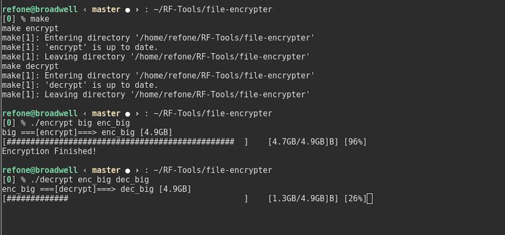

# File Encryptor



# 用途

* 利用CPU硬件加密指令高速加/解密大文件

* 多线程动态显示加/解密进度

# 使用方法

1. 设置KEY，方便起见KEY以硬编码形式写死在代码中，位于```aes/aes-ni.h```
```c
static unsigned char aes_key[16] = { ... };
```

2. Build.
```
make
```

3. 运行.
```
./encrypt <input_file> <output_file>
./decrypt <input_file> <output_file>
```
