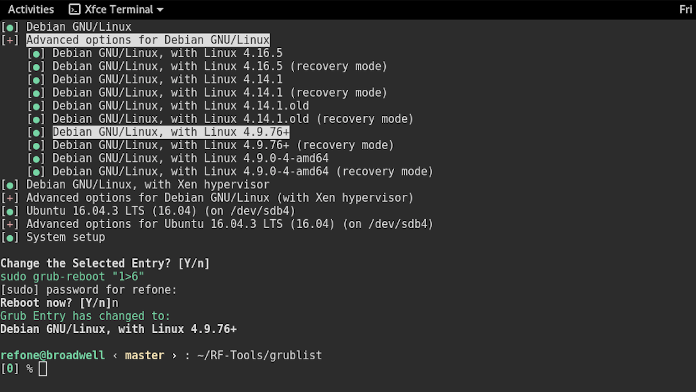

## Grub-List



#### 用途:

* 以与grub相同可视化的界面设置下一次开机锁启动的kernel版本。

* 可以用ssh远程调用脚本在关机前进行设置。

#### 使用方法:

```shellpower
./grublist
```

与grub界面相同的操作方法
* 上下方向键选择entry
* 回车或右方向键选择启动项或打开子目录
* 左方向键收起子目录
* q退出grublist
