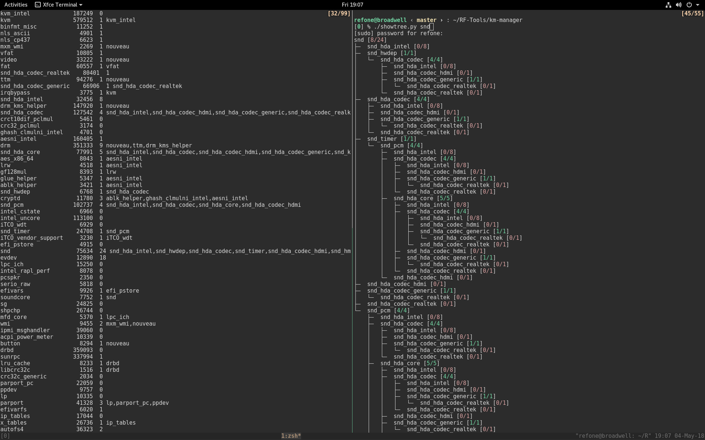

# Kernel Module Manager



#### 用途

* 输入一存在于系统的kernel module名称(在Linux环境下kernel module可以通过```sudo lsmod```进行查看)
showtree可以以该kernel module为根节点，打印其对应的kernel module依赖树。

* 每个方括号中的数字代表[能获得名字的kernel module数/依赖于该module的子module总数]，如果二者相等则显示绿色，否则显示红色。

* 有的kernel module不仅被其他的kernel module依赖，还被某些用户态进程依赖，所以会出现上述两者不相等的情况。

#### 使用方法

```
./showtree <module_name>
```
